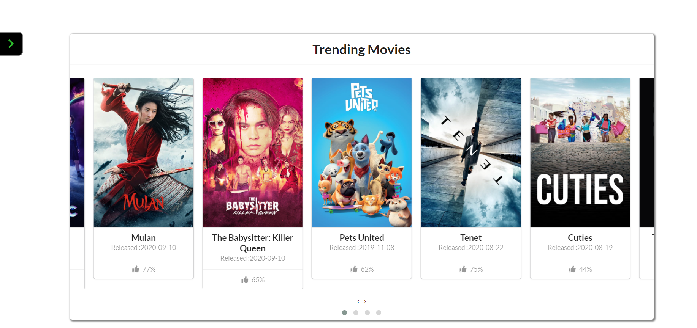

# BETA-REVIEW

#### This website is all about movie and tv shows build with the help of [TMDB](https://developers.themoviedb.org/3/getting-started/introduction) API . TMDB has database of :

> Movies 578,613  
>  TV Shows 98,084

---

## What it offers ?

- Top 20 trending movies and tv shows on daily basis.
- Every day latest entertainment news of your selected country.
- Commenting on other's reviews and writing your own reviews.
- Find out what your friend reviewed.

**NOTE :** Create an account to write a review , commenting on other's review , getting latest entertainment news on based of your geolocation and updating your geolocation.

## Previews

---

- Trending Movies and TV shows.
  
  
- Entertainment News.
  
- Updating Geolocation
  

## Set Up

---

First fork and then clone and run on your cmd line :

```bash
    npm install
    npm start
```

## License

---

[MIT](https://choosealicense.com/licenses/mit/)
